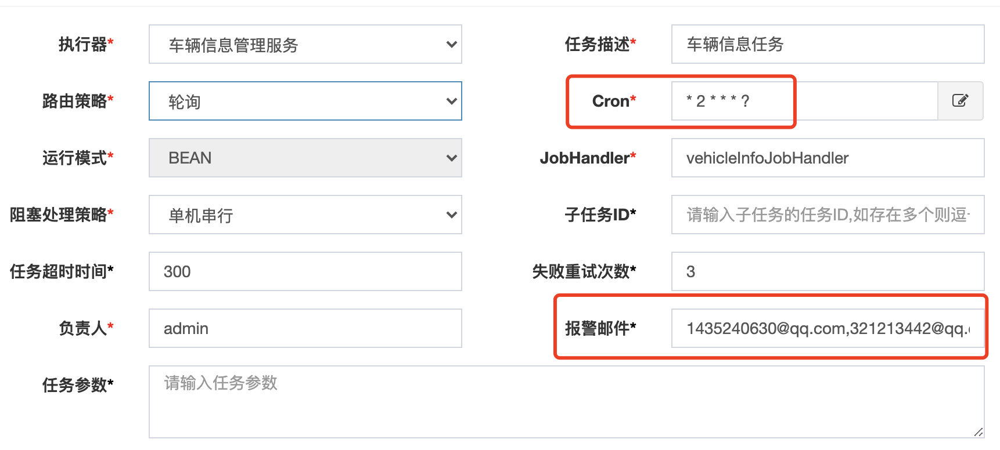

## 题目信息
>>我们需要一个车辆基本信息管理系统，用于辅助我的业务人员，解决以下问题，以便工作人员提供代理服务：  
>>  1、A车何时该检了？  
>>  2、A车保险何时到期？  
>>  3、....  
>>  
>>  编一个程序解决以上问题，要求。  
>>  1、关注服务端代码质量。最简化客户端。    
>>  2、实现语言java 、c#、kotlin、python任选。  
>>  3、采用微服务构架更佳  

### 定义：  
1. A车何时该检？距离上次车检时间满一年，提前一周（默认为一周，可配置）发送通知到业务人员  
2. A车保险何时到期？车险到期时间前一周（默认为一周，可配置）发送通知到业务人员      

## 实现思路
> 通过定时任务实现，每日凌晨2点开始执行调度任务，从车辆信息表中查询满足以上两点定义的车辆和客户信息，构建出待办通知内容发送到相关业务人员。任务执行失败或超时会重试3次，如果仍然失败会以邮件方式告知管理员。


## 地址信息
[车辆信息管理系统](http://8.129.165.17:8088) 用户名：admin 密码：123456  
[分布式任务调度(xxl-job-admin)](http://8.129.165.17:9080) 用户名：admin 密码：123456  
[前端源码仓库](https://github.com/ilsl1007/vehicle-info-management-cloud-ui) 

## 项目结构
```shell script
├── common                      ## 通用聚合模块
│   ├── common-core             ## 公共核心包
│   ├── common-job              ## 分布式任务调度支持
│   └── common-model            ## 通用实体模块
├── doc                         ## 相关文档
│   ├── db                      ## 数据库初始化脚本
├── gateway-service             ## 网关服务
├── notification-service        ## 通知服务 
├── register-center             ## 注册中心
├── user-service                ## 用户中心
└── vehicle-management-service  ## 车辆信息管理服务
```

## 版本说明
>> SpringBoot 2.2.6  
>> SpringCloud Hoxton.SR3